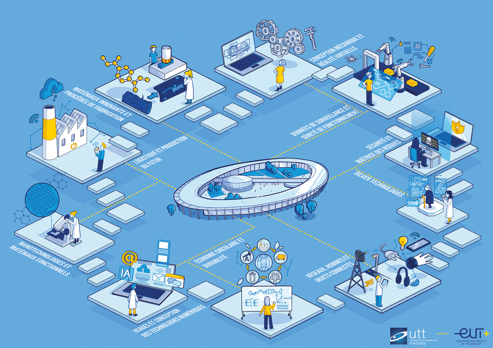

  

# Simulateur d'événements discrets en C

## Objectifs du projet 🎯

Ce projet s'inscrit dans le cadre de l'UE SY15 de la formation Génie Industriel et vise à développer un simulateur d'événements discrets en langage C. L'objectif principal est d'analyser le fonctionnement d'un système complexe à l'aide d'algorithmes de simulation.

Les compétences travaillées dans ce projet incluent :
- Structuration d'algorithmes pour la simulation de lois de probabilité et leur manipulation en C.
- Modélisation d'un système à événements discrets en identifiant les entités et leur dynamique.
- Conception et programmation d'un algorithme de simulation en langage C.
- Expérimentation et analyse des performances du système simulé.

## Modélisation du système 🏗️

Le système modélisé repose sur la plateforme PROBOT, comprenant :
- **Prod 1** : Stock initial des matières premières.
- **Warehouse** : Stock intermédiaire avant la livraison.
- **Client 2** : Destination finale des produits.
- **2 AGV (Automated Guided Vehicles)** : Véhicules autonomes transportant les produits.

### Hypothèses de travail 🔍
- Les commandes du Client 2 comprennent entre 1 et 6 produits.
- Le stock de Prod 1 est plein en début de simulation, avec des commandes préparées en FIFO.
- Le Warehouse et le Client 2 sont vides en début de simulation.
- Les AGV transportent jusqu'à 6 pièces à la fois.

## Algorithme de simulation 📜

L'algorithme de simulation suit les étapes suivantes :
1. Initialisation du système (stocks, commandes, AGV).
2. Simulation des événements (évolution des stocks, déplacements des AGV, livraisons).
3. Collecte des indicateurs de performance (
   - Temps moyen de séjour des pièces,
   - Nombre maximum de pièces dans le Warehouse,
   - Temps d'attente moyen des AGV,
   - Durée d'inactivité des AGV).
4. Simulation d'un scénario modifié (
   - Changement de vitesse d'un AGV,
   - Modification de la capacité du Warehouse,
   - Impact de la composition des commandes).
5. Analyse des résultats et comparaison avec le scénario initial.

## Expérimentations 📊

Deux types de simulations seront réalisés :
1. **Simulation du fonctionnement normal** :
   - Collecte des indicateurs de performance.
2. **Simulation d'un scénario modifié** :
   - Analyse des impacts des modifications sur les performances.

## Langage et outils 🛠️

- **Langage** : C
- **Compilateur recommandé** : GCC
- **Outils supplémentaires** : Gnuplot (visualisation des résultats)

Ce projet constitue une étape essentielle dans l'apprentissage des simulations industrielles et de la modélisation des systèmes complexes.

